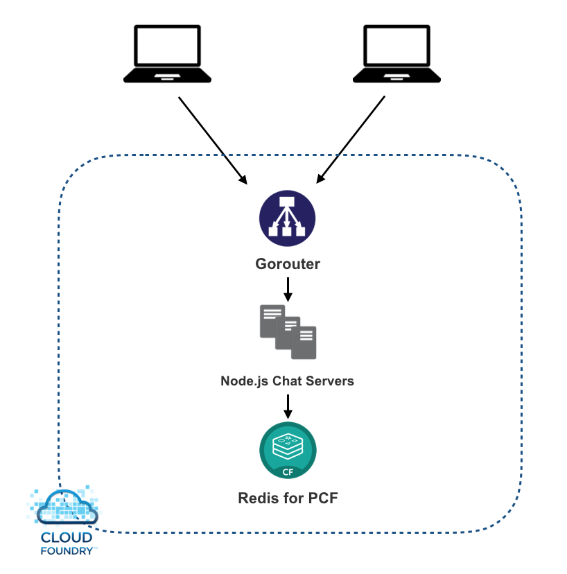
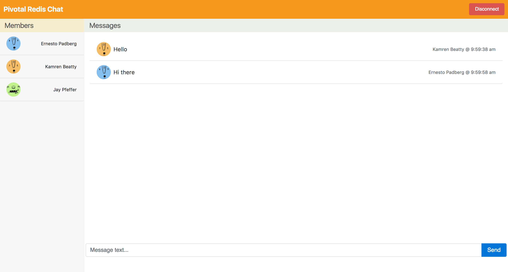

# pcf-redis-chatapp

Example architecture for building a web based chat application integrating Redis for PCF.

The Redis for PCF Chat Application (see diagram below) demonstrates how to build a web chat client using Vue.js and Socket.io on the frontend to communicate with a backend service using Node.js, Socket.io and Redis for PubSub communication.

This repository contains sample code for the frontend web client as well as the backend service implementation.  The web client is built using Vue.js for DOM manipulation and Socket.io for websocket communication to the backend service. 

The backend service is implemented using Node.js and Socket.io. The Node.js service uses the ioredis.io library to communicate with redis cluster, which supports communication between the service instances using builtin PubSub features to redis.

## Testing the example

The application can be tested by performing the following steps:

1. create a redis service on your PCF environment.
2. configure the manifest.yml based on your PCF enviroment token.
3. push this app into Cloud Foundry. 

This browser window represents one participant in the chat room.  User registration and authentication are not part of the example, and participant usernames and avatars are generated at random each time the client is loaded or refreshed in the browser.  Once the client is loaded in the browser, you should see a chatroom like the screenshot below:

You can chat with other participants in the room by typing in the message box at the bottom of the screen and clicking the Send button.  Messages that you type will appear in your chatroom and the chatroom of the other participants.

To simulate multiple users, you can open additional browser windows to add new participants to the chatroom.  New participants are added to the list on the left.  When you close a browser window, the participants are removed from the list of the other chatrooms, but the message history is retained.

Click "disconnect" button when you want to leave this chat room.